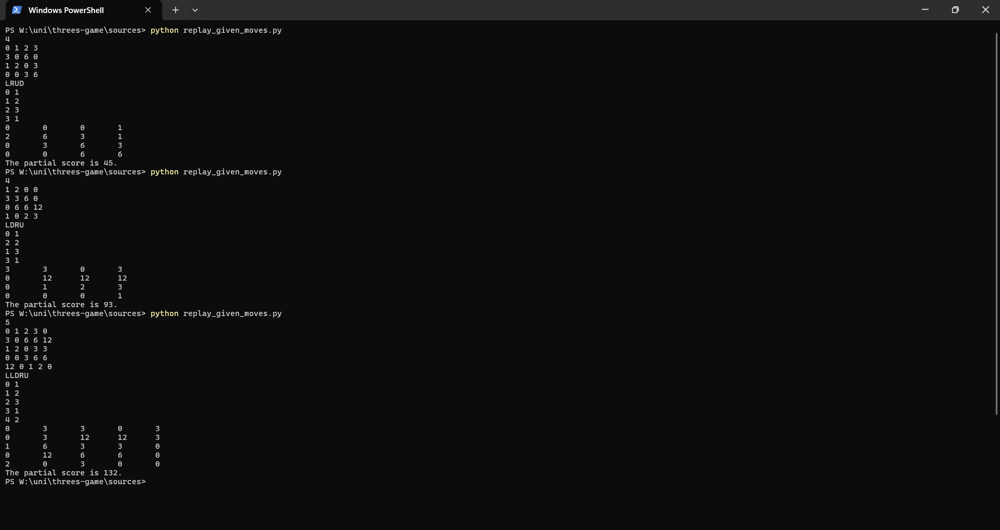
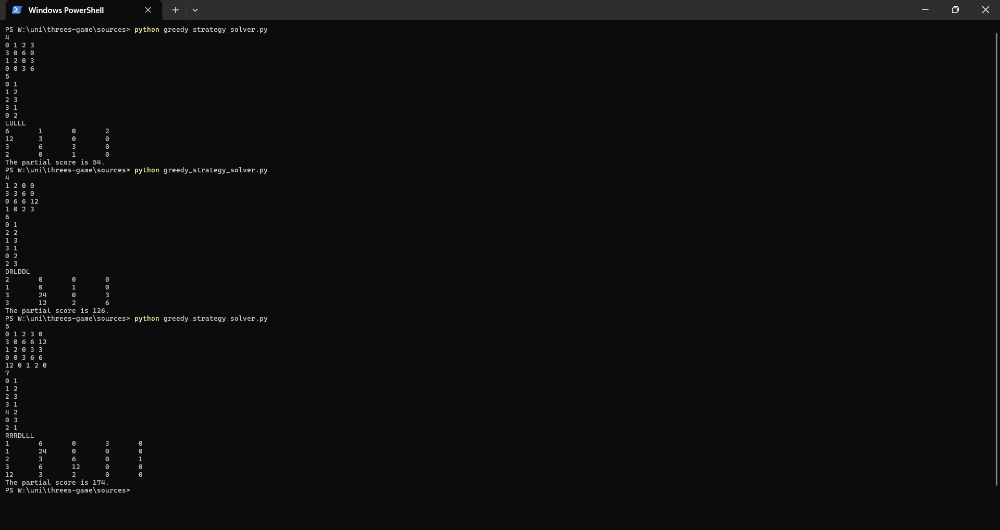
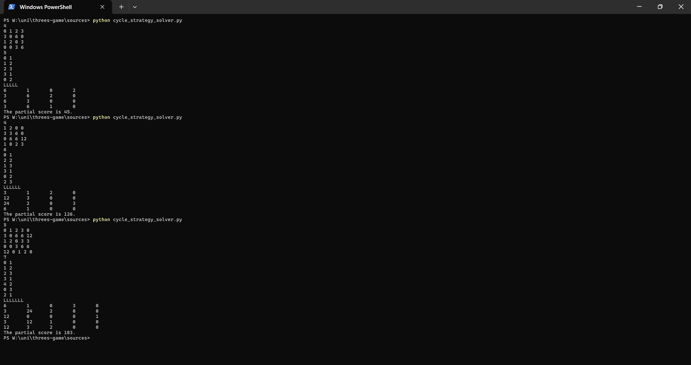

# Threes Game Solver in Python

This project is a Python implementation of the puzzle game **Threes**. It can replay a given sequence of moves or automatically choose moves using simple solver strategies. The program reads an initial board, applies movement logic, places new tiles, and calculates the final or partial score.

## What the files are doing

| File name                   | Purpose                                                          |
| --------------------------- | ---------------------------------------------------------------- |
| `replay_given_moves.py`     | Replays a given move sequence and calculates the score.          |
| `cycle_strategy_solver.py`  | Automatically solves using a fixed cycle: Left, Down, Right, Up. |
| `greedy_strategy_solver.py` | Automatically chooses the move that creates the largest merge.   |
| `threes_core.py`            | Shared movement, scoring, insertion, and game-over functions.    |

## Features

- Reads board size and initial board values from input
- Supports movement in four directions: Up, Down, Left, Right
- Merges valid tiles based on Threes game rules
- Adds new tiles after each successful move
- Calculates the final or partial score
- Prints the move sequence and final board

## How the game logic works

- `0` means an empty cell.
- `1` and `2` merge into `3`.
- Tiles `3` and above merge only with the same value.
- After a successful move, a new tile is inserted on the opposite edge.
- The placement input uses an index seed and a tile value.
- The score is printed as partial if the game can still continue, or final if no moves remain.

## Technologies Used

- Python 3.10
- Basic algorithms
- Game state simulation
- Greedy algorithm
- Board/matrix manipulation

## Input and Output Examples

### Replay Mode

Run:

```bash
python sources/replay_given_moves.py
```

Example input:

```txt
4
0 1 2 3
3 0 6 0
1 2 0 3
0 0 3 6
LRUD
0 1
1 2
2 3
3 1
```

Explanation:

- `4` is the board size.
- The next 4 lines are the initial board.
- `LRUD` is the move sequence.
- Each line after that contains a placement index and a new tile value.

Example output:

```txt
0       0       0       1
2       6       3       1
0       3       6       3
0       0       6       6
The partial score is 45.
```

### Greedy Strategy Solver

Run:

```bash
python sources/greedy_strategy_solver.py
```

Example input:

```txt
4
0 1 2 3
3 0 6 0
1 2 0 3
0 0 3 6
5
0 1
1 2
2 3
3 1
0 2
```

Explanation:

- `4` is the board size.
- The next 4 lines are the initial board.
- `5` is the maximum number of moves/new tile placements.
- Each placement line contains a placement index and a new tile value.
- The greedy solver chooses the move that creates the largest immediate merge.

Example output:

```txt
LULLL
6       1       0       2
12      3       0       0
3       6       3       0
2       0       1       0
The partial score is 54.
```

### Fixed-Cycle Strategy Solver

Run:

```bash
python sources/cycle_strategy_solver.py
```

Example input:

```txt
4
0 1 2 3
3 0 6 0
1 2 0 3
0 0 3 6
5
0 1
1 2
2 3
3 1
0 2
```

Explanation:

- `4` is the board size.
- The next 4 lines are the initial board.
- `5` is the maximum number of moves/new tile placements.
- Each placement line contains a placement index and a new tile value.
- The solver tries moves in this repeated order: `Left → Down → Right → Up`.

Example output:

```txt
LLLLL
6       1       0       2
3       6       2       0
6       3       0       0
3       6       1       0
The partial score is 45.
```

## Demo Screenshots

### Replay Mode



### Greedy Solver



### Fixed-Cycle Solver



## Solver Strategies

This project includes two simple automatic solver strategies.

### 1. Fixed Cycle Strategy

The fixed cycle solver tries moves in a repeated order:

```txt
Left → Down → Right → Up
```

If a move changes the board, the move is accepted and a new tile is inserted. If the move does not change the board, the solver skips it and tries the next direction.

This strategy is simple and predictable, but it does not analyze the whole board before choosing a move.

### 2. Greedy Merge Strategy

The greedy solver checks the possible moves and chooses the move that creates the largest immediate merge.

For example, if moving left creates a `12` tile and moving down creates a `6` tile, the solver chooses the left move.

This strategy can make stronger moves than the fixed cycle strategy, but it only looks at the current move. It does not plan several moves ahead.

## Project Limitations

This project is a console-based simulator and solver, not a full graphical version of the Threes game.

Some limitations are:

- The game is not interactive. The board, moves, and new tile placements are provided through input.
- New tiles are not generated randomly like in the original Threes game. They are inserted based on the given placement input.
- The automatic solvers use simple strategies and do not guarantee the best possible score.
- The greedy solver only chooses the best immediate merge and does not plan future moves.
- There is no graphical user interface.
- There are no unit tests yet for checking every movement and scoring case.
- The project does not include animation, keyboard controls, or real-time gameplay.

These limitations make this project more like a programming simulation of Threes logic rather than a complete playable game.

## Future Improvements

- Add unit tests for movement and scoring functions
- Improve the greedy solver strategy
- Add an optional graphical interface
- Add an interactive mode where the user can play manually

## Note

This project is not a full graphical version of Threes. It is a console-based simulator that applies Threes movement rules to a given board and uses predefined tile placements. The automatic solvers are simple strategies for choosing moves.
